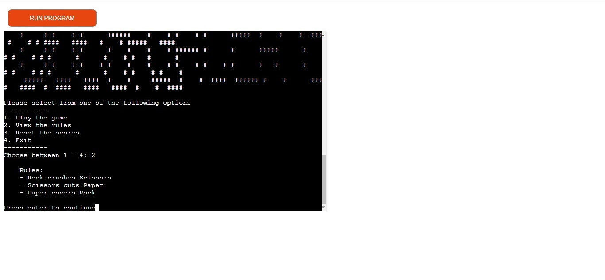
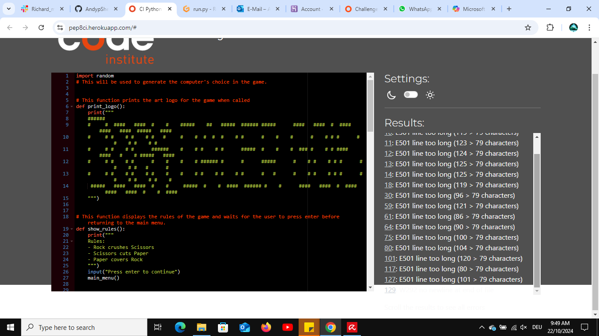

# Rock-Paper-Scissors Game
## **Overview**

The Rock-Paper-Scissors game is a Python-based version of the classic hand game. In this iteration, the user plays against the computer in a turn-based competition where the objective is to win the most rounds by selecting rock, paper, or scissors. The game is played in a terminal and provides a simple, yet engaging user experience.

The user and the computer each choose one of the three options: rock, paper, or scissors. The game uses Python’s `random` module to generate the computer’s choice, ensuring an unpredictable and fair competition. The player takes turns with the computer, and the result of each round is displayed immediately. The game continues until the player decides to stop, with scores tracked and displayed after each round.

The game features a text-based interface that guides the user through the various stages of the game. The user is prompted to enter their name, which is then used throughout the game for a personalized experience. Instructions and rules are clearly presented before the game begins, ensuring that even those unfamiliar with the classic game can quickly understand how to play.

The game leverages Python functions, loops, and conditionals to achieve the desired outcome. The player's and computer's choices are compared, and the winner is determined based on the classic rules of Rock-Paper-Scissors: rock crushes scissors, scissors cuts paper, and paper covers rock. The player’s score and the computer’s score are tracked globally, and the user can reset scores at any time.

Upon completion of each round, the player is presented with the option to play again or return to the main menu. The game is designed to provide a fun and engaging experience, making it a perfect quick-play game or a distraction during breaks.

This project serves as an excellent example of using Python for game development, showcasing the use of functions, loops, and conditionals in a real-world application. It also highlights the potential for extending terminal-based applications with additional features and enhancements.

## Features include:

- **User-Friendly Interface**: Easy-to-navigate menu options to start the game, view rules, reset scores, or exit the application.

- **Personalization**: Players are prompted to enter their name for a personalized experience.

- **Flexible Input**: Supports both full word inputs (rock, paper, scissors) and abbreviations (r, p, s) for ease of use.

- **Dynamic Score Tracking**: Continuously tracks and displays scores of both the player and the computer.

- **Replayability**: Players can play multiple rounds and return to the main menu at any time.

- **Randomized Choices**: The computer's choices are randomized using Python's random module, ensuring a fair and unpredictable game.

## Table of Contents:

**The content**

## Planning Stage

#### Target Audiences:
- People who enjoy classic games like Rock Paper Scissors.
- Individuals looking for a quick, casual game to play during short breaks.
- Players interested in a simple but engaging terminal-based game.
- Fans of traditional games looking for a digital twist.
- Aspiring coders seeking to understand basic game logic and Python programming through an interactive project.

#### User Stories:
- As a user, I want to understand the premise of the game.
- As a user, I want to quickly learn and understand the rules and instructions of the game.
- As a user, I want the game to run smoothly and bug-free in the Gitpod environment.
- As a user, I want to be able to choose whether or not to play again when the game ends.
- As a user, I want to be able to win against the computer.

#### Site Aims:

- To offer the user a smooth and bug-free version of a classic game with a modern, interactive twist.
- To provide a clean and simple interface for the user within the Gitpod environment, with no need to reference external sources.
- To provide clear instructions and a definite win condition for each round.
- To provide an enjoyable user experience of playing Rock-Paper-Scissors.
- To deliver a fun and engaging take on the traditional game that keeps users entertained.

___

### Features:
- #### Main Menu:
   It allows users to start the game, view rules, reset scores, or exit.

- #### Personalized Experience: 
  Players enter their names, which are used throughout the game.

- #### Flexible Input Options: 
  Users can input 'rock', 'paper', 'scissors', or the abbreviations 'r', 'p', 's'.

- #### Score Tracking: 
  It keeps track of and displays scores for both the player and the computer.

- #### Randomized Computer Choicesmodule for unpredictable gameplay:
  It uses Python's random module for unpredictable gameplay.
____

## Deployment on Heroku:
I have tested the game on Heroku and found no errors.
The test can be found [here](https://my-rock-paper-scissors-game-c4426078589d.herokuapp.com/)
### Data Model:
##### The game operates with several functions different managing aspects:

- **print_logo()**: Displays the game's ASCII art logo.
- **show_rules()**: Displays the rules of the game.
- **main_menu()**: Handles the main menu interactions.
- **get_user_choice()**: Validates and processes the user's input.
- **get_computer_choice()**: Randomly selects the computer's choice.
- **determine_winner()**: Compares choices and determines the winner.
- **reset_scores()**: Resets both the user's and computer's scores.
- **play_game()**: Manages the game loop, user input, and score updates.
____

### Start screen

- At the very beginning, the game is displayed showing the main menu. Each option is numbered. The player has the choice to choose for e.g ("1") to play the game or any of the other options.

- The player chooses to start the game. The game would then ask the player to enter a name to represent the player for the duration of the game.

- The game would then ask the player to choose one of the three options ( rock, paper, or sciessors) whether as full words or just the first letter of the words ( e.g. The player can simply choose "r" and the game would recognize this as "rock". The player can also choose to write the full word "rock" and it will serve the same purpose)

- If the player chooses for e.g. "s" which represents "sciessors", and the computer chooses the same option, then it shows a "tie" and the game continues without adding any points to the player nor the computer.
The game continues by asking the player whether they want to continue by choosing "y" which represents "yes" or "n" which represents "no". If the player decides to press "y" then the game continues.

- This screenshots highlights the incident if the player wins by choosing "rock" and the computer "sciessors" then it declares the player the winner, and adds plus one to the score for the player. The game would then ask the player if they want to continue.

- This screenshot highlights the incident when the computer wins ensuring the randomness of the process when it comes to choosing one of the three options.

- If the player chooses "n" which represents "no" not to continue, and decides to reset the score then the player would choose number three from the main menu aand the score will be reset.

- If the player decides to play again but decides to choose "5" from the list which is invalid since there are only the options from 1 to 4 then the game would note the player that they have chosen an invalid number and ought to choose a correct number.

- This screenshot highlights the incident when the player wants to know the rules of the game. Number three when chosen, it will show the rules of the game and which option is stronger than the other. There were three sentences to demonstrate that.

_____

### **Future Enhancements**:
 ####  There are several areas with scope for future improvement. This project has been very challenging, and ultimately the project deadline was looming. I would have liked to add the following:
- Adding a player vs player option.
- The option of skipping the rules for returning players.
- The option to randomly choose the computer's selection for quicker games.
- An option to have different difficulty levels with varying randomness or predictability of the computer's choices.
____
## Testing Phase: 

- **Implementation**: I wanted to make sure the game performed as expected from start to finish.
- **Test**: I played the game on a local terminal and on Heroku over twenty times.
- **Result**: The game worked as anticipated with no errors.
- **Verdict**: Test passed.

___

- **Implementation**: Check the game ends as expected and offers the play again option upon completion.
- **Test**: I played the game multiple times, winning and losing. I selected play again and quit at random.
- **Result**: The game worked as anticipated with no errors.
- **Verdict**: Test passed.

## Linter CI Testing:
- I have tested my file on Linter CI and found no errors.

## Bugs
#### The following bugs were identified during user testing:
- 🐞 - The scores of the player and computer were not kept tracked during the game.
- ⚒️ - I realized that there was no code that ensures its functionality.
- ✅ - On line 116 and 117, I added global variables to keep track of the scores of the player and computer. 

____

## Unfixed Bugs
- There are no known unfixed bugs.

## Deployment:
### **Steps to Deploy to Heroku**

1. **Log in to Heroku or create an account if required.**

2. **Create a New App**:
    - Click the button labeled "New" from the dashboard in the top right corner.
    - Select "Create new app" from the drop-down menu.
    - Enter a unique app name. For example, you might choose `rock-paper-scissors-game`.
    - Select the relevant region based on your location.
    - Click the "Create app" button.

3. **Configure the App**:
    - Navigate to the "Settings" tab of your new app.
    - Scroll down to the "Config Vars" section.
    - Click the button labeled "Reveal Config Vars".
    - Enter the "key" as `PORT` and the "value" as `8000`, then click the "Add" button.

4. **Add Buildpacks**:
    - Scroll down to the "Buildpacks" section of the settings page.
    - Click the button labeled "Add buildpack", select "Python", and click "Save Changes".
    - Repeat the step to add "node.js". Make sure that "Python" is listed first. If not, you can click on it and drag it upwards to change the order.

5. **Deploy the App**:
    - Navigate back to the "Deploy" tab.
    - In the "Deployment method" section, select "GitHub".
    - Confirm that you want to connect to GitHub.
    - Search for your repository name and click the "Connect" button next to the intended repository.
    - Choose your preferred deployment type:
        - Click "Enable Automatic Deploys" for automatic deployment when you push updates to GitHub.
        - Or select the correct branch for deployment from the drop-down menu and click the "Deploy Branch" button for manual deployment.

6. **Run the App**:
    - Once the deployment is complete, navigate to the "Activity" tab to see the build logs.
    - You can open your app using the provided Heroku URL.

### **Tech**

I used the following technologies for the Rock-Paper-Scissors project:
- **Python**: For the core game logic and functionality.
- **Gitpod**: As the development environment.
- **Git**: For version control and code management.
- **Heroku**: For deploying the game online.

## Libraries

-
-

## Software
-
-
-
-

## Media
Not in the scope of this project.

## Credits
-
-
-
-

## Honorable Mentions
- A huge thank you to my mentor, Richard Wells, for his generous time and invaluable feedback throughout this project. His insights, ideas, and support have been a tremendous help and source of motivation.

- Thanks to the Code Institute team for providing me with some basic knowledge of Python.

- Thanks to the Code Institute community on Slack who helped remind me that everyone has difficult days.

- A huge thank you to my friends who support my coding journey on a daily basis.

